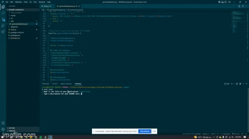

# README.md Generator

  ## Description
  This command line application uses the Inquirer NPM, File System (FS), and Node.js to construct a markdown readme framework based on the answers of the prompts given to users

  ## Demonstration
  

  [Video Link](https://drive.google.com/file/d/1e1sAo6Cs3j0ioHTJ98gfcNv22Exm872g/view)

  ## Installation
  💾   
  To generate your own README, `git clone` the repo down to your local so you have the Node project on your local.
  
  `npm init`
  
  `npm install inquirer`

  ## Usage
  Open the application in VS Code open up you terminal and from the root of the project run
  `node index`
  or
  `node index.js`
  From there answer the following promts to fill in the sections of the README.md. When you're finished a success message will appear in the terminal and your new REAME.md file will be located in the results folder.

  ## Links
  [GitHub Repositry](https://github.com/MichaelS32/README-generator)

  ## Contributors
  [MichaelS32](https://github.com/MichaelS32)

  ## License
  Please visit the link for detailed information on this license.

  [MIT](https://www.mit.edu/~amini/LICENSE.md)